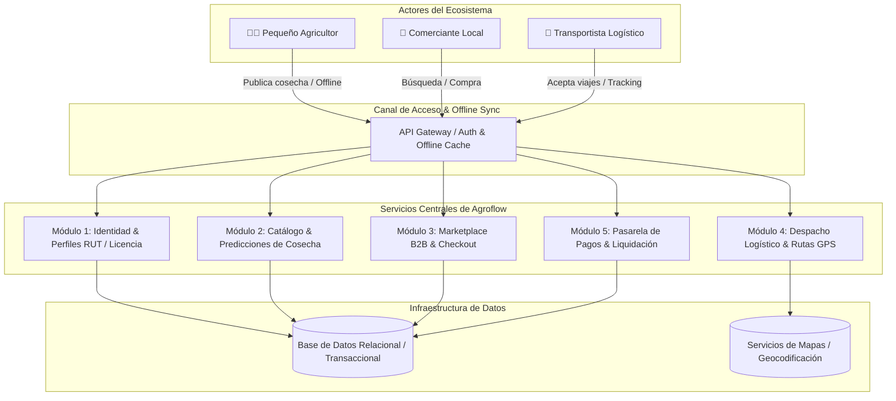

# 🌱 Proyecto Agroflow: Especificación de Requerimientos y Hoja de Ruta Scrum

[](https://es.wikipedia.org/wiki/Tecnolog%C3%ADa_agr%C3%ADcola)
[](https://www.scrum.org/)
[](#-arquitectura-general-del-sistema)
[](validate_spec.py)
[-darkgreen.svg)](#-requerimientos-no-funcionales)

Documento formal de **Ingeniería de Requerimientos (SRS)**, diseño de arquitectura de software y **planificación ágil (Scrum)** para **Agroflow**: plataforma digital orientada a optimizar la cadena de suministro agropecuaria conectando directamente a pequeños productores agrícolas con comercios locales y operadores de transporte.

---

## 📋 Tabla de Contenidos

- [Contexto y Problema que Resuelve](#-contexto-y-problema-que-resuelve)
- [Propuesta de Valor y Solución](#-propuesta-de-valor-y-solución)
- [Arquitectura General del Sistema](#-arquitectura-general-del-sistema)
- [Matriz de Stakeholders](#-matriz-de-stakeholders)
- [Módulos y Requerimientos Funcionales](#-módulos-y-requerimientos-funcionales)
- [Requerimientos No Funcionales](#-requerimientos-no-funcionales)
- [Épicas del Producto](#-épicas-del-producto)
- [Planificación de Sprints y Complejidad](#-planificación-de-sprints-y-complejidad)
- [Artefactos y Enlaces del Proyecto](#-artefactos-y-enlaces-del-proyecto)
- [Validación Automatizada](#-validación-automatizada)
- [Autor](#-autor)

---

## 🎯 Contexto y Problema que Resuelve

En el sector agropecuario latinoamericano, la intermediación excesiva y la falta de información oportuna generan dos graves problemáticas:
1. **Pérdidas postcosecha críticas:** Entre el 20% y el 35% de los alimentos frescos se degradan antes de llegar al punto de venta final debido a demoras logísticas y falta de canales de comercialización directos.
2. **Asimetría económica:** Los pequeños agricultores reciben márgenes mínimos por sus cosechas, mientras que los comercios locales asumen altos costos de intermediación sin contar con trazabilidad sobre el origen y calidad de los productos.

---

## 💡 Propuesta de Valor y Solución

**Agroflow** estructura un ecosistema digital colaborativo que integra oferta, demanda y logística en tiempo real:
- **Para el Agricultor:** Publicación ágil de cosechas actuales y futuras, acceso a precios justos y validación de identidad oficial.
- **Para el Comerciante:** Abastecimiento directo con múltiples productores locales, filtros georreferenciados y desglose transparente de costos (producto + transporte).
- **Para el Transportista:** Oportunidades de viaje geolocalizadas según capacidad de carga (peso/volumen), optimización de rutas y pruebas de entrega digitales.

---

## 🏛 Arquitectura General del Sistema



---

## 👥 Matriz de Stakeholders

| Stakeholder | Rol Principal | Acciones Clave | Beneficio Esperado |
|---|---|---|---|
| **Pequeños Productores Agrícolas** | Proveedores primarios | Cultivan, cosechan y ofertan productos agrícolas. | Incremento de ingresos, reducción de merma postcosecha y apertura a nuevos mercados. |
| **Operadores de Transporte** | Facilitadores logísticos | Gestionan la recogida en finca, almacenamiento y entrega en destino. | Optimización de capacidad instalada, menor kilometraje en vacío y cobros garantizados. |
| **Comerciantes y Tiendas** | Canales comerciales | Compran producto fresco directamente en origen. | Mayor frescura, márgenes comerciales transparentes y estabilidad de stock. |
| **Equipo Tecnológico** | Desarrolladores de plataforma | Diseñan, desarrollan y mantienen la solución digital. | Generación de impacto social escalable y modelo de negocio sostenible. |

---

## 📦 Módulos y Requerimientos Funcionales

### 1. Módulo de Autenticación y Confianza
* **Registro diferenciado por rol:** Formularios específicos según las responsabilidades operativas (Agricultor, Comerciante, Transportista).
* **Validación documental legal:** Carga y verificación de documentos oficiales (Cédula de ciudadanía, RUT/NIT y licencia de conducción para transportistas).
* **Perfil georreferenciado:** Fijación del punto GPS de la finca o bodega para el cálculo automático de fletes.

### 2. Módulo del Agricultor (Oferta)
* **Gestión de Catálogo:** Creación y actualización de productos con fotos, descripción, stock disponible, unidad de medida y precio por unidad.
* **Disponibilidad anticipada de cosechas:** Programación de cosechas futuras (ej. *"Disponibilidad de 500 kg de tomate en 2 semanas"*).
* **Gestión de pedidos:** Panel de aceptación o rechazo de órdenes entrantes.

### 3. Módulo del Comerciante (Demanda)
* **Marketplace con filtros avanzados:** Búsqueda por tipo de cultivo, cercanía en kilómetros, fecha de recolección y rango de precio.
* **Carrito y Checkout transparente:** Desglose visible del valor de los productos frente a la tarifa del transporte antes de pagar.
* **Historial y comprobantes:** Descarga de facturas y órdenes de compra digitales.

### 4. Módulo de Logística y Trazabilidad (Transportistas)
* **Alertas de carga cercana:** Notificaciones basadas en geolocalización filtradas por volumen y peso.
* **Visualización de ruta:** Indicación de punto de recogida (finca) y punto de entrega (comercio).
* **Actualización de estados:** Marcadores de avance (*"Producto Recogido"*, *"En Camino"*, *"Entregado"*).
* **Prueba de entrega digital:** Registro fotográfico y firma digital al momento de la recepción.

---

## 🛡 Requerimientos No Funcionales

* **Seguridad:** Registro inmutable de auditoría para todas las transacciones durante un mínimo de 12 meses. Publicación restringida exclusivamente a productores validados.
* **Rendimiento:** Capacidad para **10,000 usuarios simultáneos**. Tiempo de carga del catálogo `< 2 segundos` en conexiones móviles 3G rurales, búsquedas `< 500 ms` y degradación máxima del 10% durante picos de cosecha.
* **Usabilidad Rural:** Interfaz intuitiva y de bajo texto pensada para usuarios con bajo nivel de alfabetización digital; publicación de productos en máximo 5 pasos.
* **Conectividad (Offline-First):** Registro y consulta local en zonas sin cobertura celular, con sincronización automática al restablecerse la conexión. Disponibilidad mínima del **99.5%**.
* **Impacto Ambiental:** Diseñado para reducir el desperdicio de alimentos agrícolas en al menos un **20%** en el primer año y mantener la ventana cosecha-venta en menos de **48 horas**.
* **Mantenibilidad y Código:** Arquitectura desacoplada, código limpio documentado al menos en un 80% y ventanas de despliegue con interrupción máxima de 5 minutos.

---

## 🚀 Épicas del Producto

1. **Épica 1 — Gestión de Oferta y Catálogo Agrícola:** Creación y mantenimiento del inventario del productor.
2. **Épica 2 — Marketplace y Abastecimiento (Tiendas):** Experiencia de compra multi-productor y programación de pedidos.
3. **Épica 3 — Gestión Logística y Transporte:** Emparejamiento de viajes, pesos y volúmenes con transportistas disponibles.
4. **Épica 4 — Seguimiento y Geolocalización (Trazabilidad):** Monitoreo en tiempo real, cálculo de ETA y mapas de ruta.
5. **Épica 5 — Confianza y Transacciones:** Sistema de reputación bidireccional, confirmación de entrega y pasarela de pago segura.

---

## ⏱ Planificación de Sprints y Complejidad

Cada Sprint tiene una duración fijada en **10 días hábiles**:

### Sprint 1: Fundaciones de Catálogo, Registro y Pedidos (10 días)
| Historia de Usuario | Épica | Complejidad (SP) | Tiempo Est. |
|---|---|:---:|:---:|
| Cargar productos (Fotos, descripción, stock) | Oferta | 8 | 2 días |
| Registro de perfiles (Campesino, Tienda, Transportador) | Sistema | 8 | 2 días |
| Catálogo de productos (Visualización y filtros básicos) | Marketplace | 2 | 2 días |
| Geolocalización de Finca (Punto de recogida GPS) | Seguimiento | 1 | 2 días |
| Carrito y Pedido (Crear la orden de compra) | Marketplace | 2 | 2 días |
| **Total Sprint 1** | | **21 SP** | **10 días** |

### Sprint 2: Logística, Geolocalización y Seguridad (10 días)
| Historia de Usuario | Épica | Complejidad (SP) | Tiempo Est. |
|---|---|:---:|:---:|
| Alertas de carga (Notificar peso/volumen al transporte) | Logística | 1 | 2 días |
| Mapa y Rutas (Integración con servicios de mapas) | Seguimiento | 1 | 3 días |
| Identidad del Transportista (Foto y placa para seguridad) | Seguridad | 2 | 1 día |
| Tracking en tiempo real (Ubicación de la mercancía) | Seguimiento | 13 | 2 días |
| Prueba de entrega (Firma digital o foto de llegada) | Seguridad | 2 | 2 días |
| **Total Sprint 2** | | **19 SP** | **10 días** |

### Sprint 3: Monetización, Sincronización Offline y UX Rural (10 días)
| Historia de Usuario | Épica | Complejidad (SP) | Tiempo Est. |
|---|---|:---:|:---:|
| Pasarela de Pagos (Pago seguro y directo) | Finanzas | 40 | 3 días |
| Liquidación de Comisiones (Reparto automático $) | Finanzas | 8 | 2 días |
| Modo Offline (Sincronización básica sin internet) | Sistema | 3 | 2 días |
| Sistema de Reputación (Calificaciones entre actores) | Seguridad | 2 | 1 día |
| Interfaz Minimalista (Ajuste de usabilidad rural) | Sistema | 1 | 2 días |
| **Total Sprint 3** | | **54 SP** | **10 días** |

---

## 📎 Artefactos y Enlaces del Proyecto

* 📄 **Documento de Especificación Original (PDF):** [`AGroflowRuta.pdf`](AGroflowRuta.pdf)
* 📋 **Tablero Scrum de Trello:** [Ver Tablero de Historias de Usuario](https://trello.com/invite/b/69e7ce3b150aa8333a0c7654/ATTI5662901a9743029e42e2a97f9e4d4c631E6B399E/scrum)
* 🎥 **Grabación de Daily Scrum:** [Ver Video en Google Drive](https://drive.google.com/file/d/1JArPqhSum8ZMuRtpVuchRcbsEu5GOKPF/view?usp=drivesdk)
* 📊 **Esquema Estructurado JSON:** [`srs-agroflow.json`](srs-agroflow.json)

---

## 🧪 Validación Automatizada

Para comprobar la integridad del modelo de datos de requerimientos y la consistencia matemática de la planificación de Sprints, ejecuta el validador:

```bash
python validate_spec.py -v
```

**Resultado:**
```text
test_epicas_y_sprints_scrum (__main__.TestAgroflowSpec.test_epicas_y_sprints_scrum) ... ok
test_metadatos_basicos (__main__.TestAgroflowSpec.test_metadatos_basicos) ... ok
test_modulos_funcionales (__main__.TestAgroflowSpec.test_modulos_funcionales) ... ok
test_requerimientos_no_funcionales (__main__.TestAgroflowSpec.test_requerimientos_no_funcionales) ... ok
test_stakeholders_completos (__main__.TestAgroflowSpec.test_stakeholders_completos) ... ok

Ran 5 tests in 0.001s
OK
```

---

## 👤 Autor

**David Leonardo Martínez**
- GitHub: [@Zenda0610](https://github.com/Zenda0610)
- Email: [davidlealperez522@gmail.com](mailto:davidlealperez522@gmail.com)